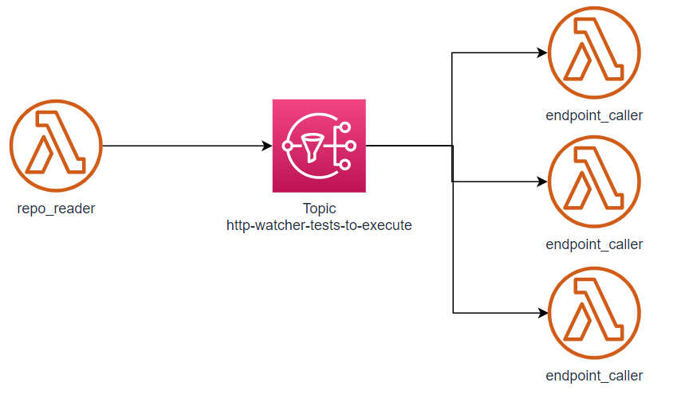

# http-watcher
Http rest api endpoint monitoring written in python



# Ideas...

The idea is to use lambda functions to create an easy way of calling API rest endpoints.

The first goal is to call GET APIs.

With that send these informations to a time-series database. The idea is to start collection some metric data to use later.

Most probable metric structure:

```
http_endpoint_monitoring_total
```
With probable labels
```
expected_status_code="2xx|3xx|4xx|5xx"
received_status_code="2xx|3xx|4xx|5xx"
method="GET|POST|PATCH"
uri="http://xxx"
test_status="success|failure"
```

It should read one json file per endpoint to call.
Sample of json structure:
```json
{
    "method":"GET",
    "uri":"https://api.thedogapi.com/v1/images/search",
    "headers":
        {
            "x-api-key":"ABC123"
        },
    "expected_status_code":"200"
}
```

# Samples Used

Got some ideas from [aws-lambda-developer-guide](https://github.com/awsdocs/aws-lambda-developer-guide/tree/main/sample-apps/blank-python)

Used also [localstack](https://github.com/localstack/localstack)

In the sample I'm calling the [The Dog API](https://thedogapi.com/)

# Package pip command

Creating a virtual environment for packaging
```
python -m virtualenv .
```
Installing requirements
```
pip install -r .\requirements.txt -t ./
```

# Localstack commands

To create an s3 Bucket:
```
aws --endpoint-url=http://localhost:4566 s3 mb s3://jsonrepo
```

To copy some file to S3 Bucket:
```
aws --endpoint-url=http://localhost:4566 s3 cp .\GET_images.json s3://jsonrepo
```

To create an SNS topic:
```
aws --endpoint-url=http://localhost:4566 sns create-topic --name tests_to_execute
```

To create an lambda function:
```
aws --endpoint-url=http://localhost:4566 lambda create-function --function-name endpoint-caller --zip-file fileb://functions.zip --handler lambda_endpoint_caller.lambda_handler --runtime python3.8 --role 'bla'
```

Execute local lambda:
```
aws --endpoint-url=http://localhost:4566 lambda invoke --function-name endpoint-caller --payload fileb://payload.json saida.json
```
